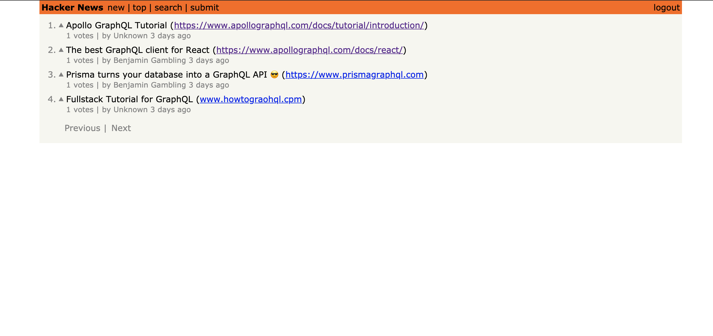
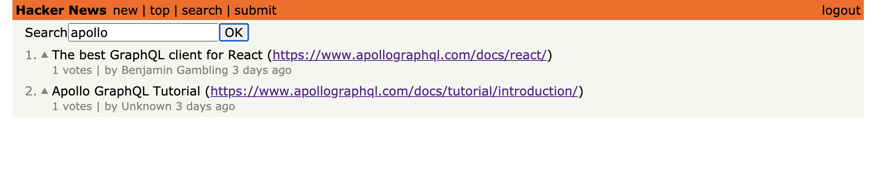

# Hacknews Clone

In this porject i created a clone of Hackernews. The front end was created using React and Apollo while the back end was created using GraphQl and Node. The interface is baasic but the focus was to learn new concepts about more effective and efficent data querying. This was learnt through https://www.howtographql.com/.

# 

## Table of contents

1. [Demo](#demo)
2. [Technologies](#technologies)
3. [Features](#features)
4. [Development](#development)
5. [License](#license)

## Demo

Here is the working live demo:
[https://bgwd-hackernews-clone.herokuapp.com/](https://bgwd-hackernews-clone.herokuapp.com/).

## Technologies

Client

- ReactJS
- Apollo

Server

- Node.js
- GraphQL Yoga (GraphQL server built on top of Express.js)
- Prisma w/ PostgreSQL Database

## Features

- CRUD featues
- GraphQL
- Heroku PostgreSQL Database
- Sorts by posts with highest number of upvotes
- Post + Voting featurs for registered users
- Filter through search function
- User Auth
- Storing JWTs in localStorage is not a safe approach to implement authentication on the frontend but wanted to keep things simple to focus on GraphQL.

# 

# 

### Devlopment

- Expand on topics learnt
- Better design
- Show messages for incorrect password/user doesnt exist etc.

## License

> You can check out the full license [here](LICENSE)

This project is licensed under the terms of the **MIT** license.
